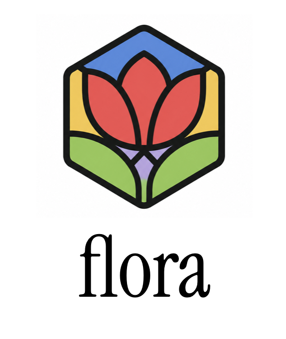

<p align="center">
  
</p>

<p align="center">
  <a href="https://www.npmjs.com/package/@topspinj/flora"></a>
  <a href="https://www.npmjs.com/package/@topspinj/flora"></a>
  <a href="https://pypi.org/project/florajs/"></a>
  <a href="LICENSE"></a>
</p>

<p align="center"><b>The diagram renderer built for the AI era.</b><br>Most diagram syntax is now machine-generated and imperfect. Flora renders it gracefully instead of failing silently.</p>

## Broken input, working diagram

LLMs write Mermaid constantly — and get it slightly wrong constantly. Feed this to a strict parser and you get a blank screen:

```
flowchart TD
  A[User request] --> B{Cache hit?}
  B -->|yes| C[Return cached]
  B -->|no| D[(Postgres]
  style D fill:#f9f
  D --> E[Query and render]
```

**Strict parsers (Mermaid):** `Parse error on line 4 ... Expecting 'SQE', got 'PS'`. Nothing renders. Your UI shows an error box or nothing at all.

**Flora:** the four valid lines render as an interactive diagram. The unclosed `D[(Postgres]` is skipped whole and reported as a structured diagnostic — never reinterpreted as garbage nodes — and the `style` directive is acknowledged and deliberately ignored:

```json
[
  { "line": 4, "col": 16, "message": "Unterminated () (missing closing ))", "severity": "error" },
  { "line": 5, "col": 3, "message": "'style' ignored: styling directive — Flora handles styling through themes", "severity": "info" }
]
```

Try it live in the [playground](https://florajs.dev/playground/) — diagrams are encoded in the URL, so they're shareable with a link.

## Quickstart

### JavaScript

```bash
npm install @topspinj/flora
```

> [!NOTE]
> The npm package is `@topspinj/flora` — `florajs` on npm is an unrelated package.

```javascript
import { render } from "@topspinj/flora";

const { warnings } = render(
  `flowchart LR
    A[Start] --> B{Decision}
    B -->|Yes| C[Do thing]
    B -->|No| D[Other thing]`,
  document.getElementById("diagram")
);
```

Or with no build step — the CDN bundle registers a `<flora-diagram>` custom element:

```html
<script src="https://unpkg.com/@topspinj/flora"></script>

<flora-diagram theme="default">
flowchart TD
  A[Dashboard] --> B[API]
  B --> C[(Database)]
</flora-diagram>
```

Diagrams are interactive by default: scroll to zoom, drag to pan, click a node to highlight its upstream/downstream lineage.

### Python / Jupyter

```bash
pip install florajs
```

```python
from florajs import Diagram

d = Diagram("""
flowchart TD
  a[Start] --> b{Decide}
  b -->|yes| c([Done])
  b -->|no| a
""", theme="sketch")
d              # displays interactively in Jupyter
d.to_svg_file("decision.svg")  # headless export — embedded V8, no browser
```

There's also a programmatic `Flowchart` builder — see the [Python docs](python/).

## Fault tolerance is the contract

Flora's rule is **never blank, never silently wrong**. Every line of input lands in one of three tiers:

1. **Supported** — graph structure: nodes and shapes, edges and labels, chaining, subgraphs, direction, comments. Renders faithfully.
2. **Gracefully ignored** — Mermaid presentation/behavior directives (`classDef`, `class`, `style`, `linkStyle`, `click`, `%%{init}%%`). Recognized, skipped, reported as `info` diagnostics. Flora handles styling through themes and clicks through `onNodeClick`.
3. **Rejected loudly** — anything the parser can't understand is skipped whole and reported as an `error` diagnostic (`{ line, col, message, severity }`). It is never guessed into extra nodes. If nothing parses, `render()` shows an error card, not an empty SVG.

Prefer failing? Pass `strict: true` to throw a `FloraParseError` (diagnostics on `.warnings`) instead of rendering best-effort. The rehype plugin is strict by default so broken diagrams fail your build.

## API

All functions accept the same options (below) and return `warnings` alongside their result.

| Function | Returns |
|---|---|
| `render(input, element, options?)` | renders into a DOM element |
| `toSVGElement(input, options?)` | detached `SVGSVGElement` |
| `toSVGString(input, options?)` | SVG markup string (no DOM needed) |
| `toPNG(input, options?)` | `Promise<Blob>` |
| `toAST(input, options?)` | parsed AST, no rendering |
| `toLayout(input, options?)` | computed node/edge positions |

### Options

```typescript
{
  theme: "default" | "tufte" | "digital" | "sketch" | { /* overrides */
    background: "#ffffff",
    nodeColors: { fill: "#f0f4ff", stroke: "#4f6df5", text: "#1e293b" },
    edgeColors: { stroke: "#94a3b8", label: "#64748b" },
    fontFamily: "Inter, sans-serif",
    fontSize: 14,
    nodeRadius: 8,
    shadow: true,
  },
  interactive: true,     // zoom, pan, hover, click-to-highlight lineage
  strict: false,         // throw FloraParseError instead of best-effort
  onNodeClick: (nodeId) => {},
  onNodeHover: (nodeId) => {},
  onHighlight: (nodeId, upstream, downstream) => {},
}
```

### Node shapes

| Shape | Syntax | | Shape | Syntax |
|---|---|---|---|---|
| Rectangle | `A[text]` | | Stadium | `A([text])` |
| Rounded | `A(text)` | | Cylinder | `A[(text)]` |
| Diamond | `A{text}` | | Queue | `A[[text]]` |

Subgraphs (`subgraph Name ... end`) render as collapsible groups and nest.

### React

```jsx
import { Flora } from "@topspinj/flora/react";

<Flora input={source} theme="tufte" onNodeClick={(id) => select(id)} />
```

### Rehype (Markdown pipelines)

```javascript
import rehypeFlora from "@topspinj/flora/rehype";
// turns ```flora / ```mermaid code fences into rendered diagrams; strict by default
```

## Use with Claude Code

Flora ships a [Claude Code](https://claude.com/claude-code) plugin — a skill that writes correct Flora syntax, visualizes dbt lineage from a `manifest.json`, and returns playground share links:

```
/plugin marketplace add topspinj/florajs
/plugin install flora@florajs
```

Then: `/flora draw the auth flow for my app`. The skill uses the open [Agent Skills](https://code.claude.com/docs/en/skills) format, so it works with other agents too.

## Feedback & contributing

Flora is young and shaped by the people using it. [Bugs](https://github.com/topspinj/florajs/issues/new?template=bug_report.yml) (a playground link is the perfect repro), [feature requests](https://github.com/topspinj/florajs/issues/new?template=feature_request.yml), and [general feedback](https://github.com/topspinj/florajs/issues/new?template=feedback.yml) all go through GitHub issues. PRs welcome — the [open issues](https://github.com/topspinj/florajs/issues) are a good place to start.

## License

MIT
